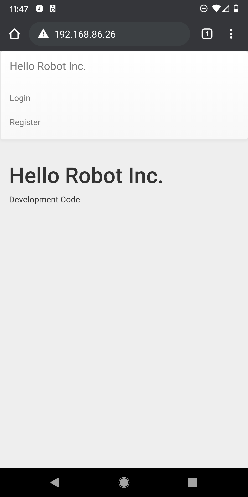
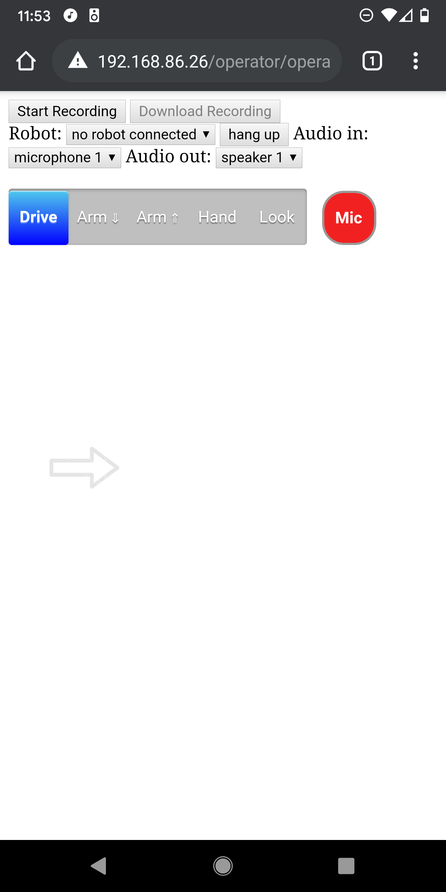
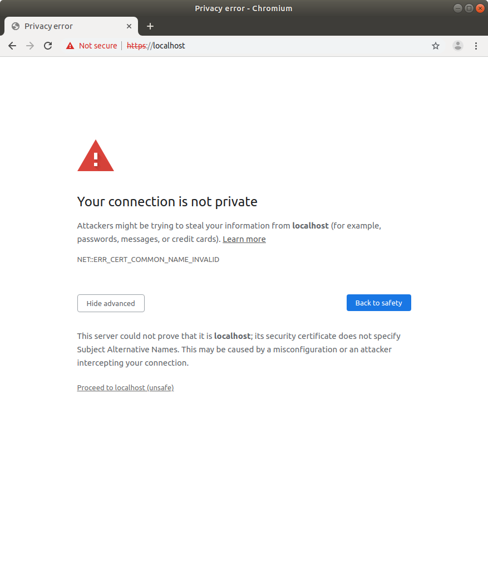
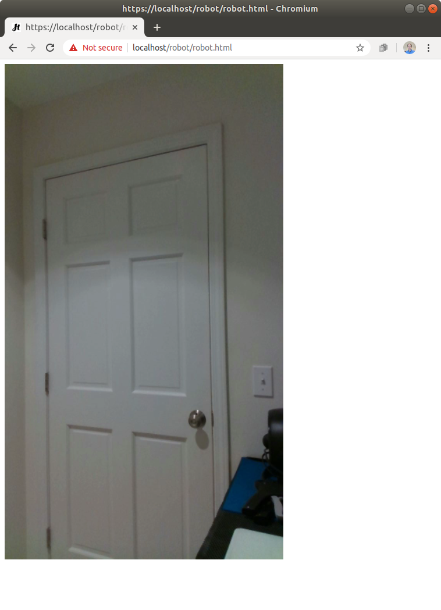

# Overview

This repository holds prototype code that enables a person (the operator) to remotely teleoperate a Stretch RE1 (the robot) through a recent Chrome/Chromium web browser on an Android mobile phone, laptop, or desktop. The Stretch RE1 is a mobile manipulator from Hello Robot Inc.

**WARNING: This is prototype code has been useful to the community, but it's not well tested. There are also security issues, especially if you use the default credentials. Use this code at your own risk.** 

## History

When we started Hello Robot Inc. back in 2017, part of our goal was to create a robot that could be intuitively teleoperated from afar. We took an iterative approach, building a series of 7 prototype robots before the Stretch RE1 that we sell today. In conjunction with these prototypes, we developed a series of web interfaces, so that we could control our robots via a web browser and test remote teleoperation. While we eventually deemphasized this aspect of the robot, we still think the code could be useful to the community. With this goal in mind, we ported parts of our old web interface code to the Stretch RE1 and made them available in this repository back in June of 2020.

## The Robot and the Operator both use Web Browsers

This web interface works via [Web Real-Time Communication (WebRTC)](https://en.wikipedia.org/wiki/WebRTC). Code runs in a browser on the robot, in a browser on the operator's device (e.g., a mobile phone), and on a server. This is analogous to the robot and the operator video conferencing with one another, although they communicate via realtime data in addition to audio and video.

The robot’s browser uses [rosbridge](http://wiki.ros.org/rosbridge_suite) to connect with ROS on the robot. Rosbridge translates [JSON](https://en.wikipedia.org/wiki/JSON) from the robot’s browser into ROS communications and vice versa. The JavaScript code used by the robot’s browser to connect with ROS can be found in [ros_connect.js](https://github.com/hello-robot/stretch_web_interface/blob/master/robot/ros_connect.js) under the [robot directory](https://github.com/hello-robot/stretch_web_interface/tree/master/robot), which holds files made available to the robot's browser. 

With [puppeteer](https://github.com/puppeteer/puppeteer) the robot can automatically launch and login to its browser. For example, [start_robot_browers.js](https://github.com/hello-robot/stretch_web_interface/blob/master/start_robot_browser.js) uses puppeteer to launch the robot's browser and login with default, plain text credentials to simplify development. 

While the robot’s browser has access to most of the robot via ROS, the operator’s browser can only access the robot indirectly through the robot’s browser. The commands available to the operator’s browser can be found in [commands.js](https://github.com/hello-robot/stretch_web_interface/blob/master/shared/commands.js) under the [shared directory](https://github.com/hello-robot/stretch_web_interface/tree/master/shared), which holds files available to both the operator's browser and the robot's browser. The operator's browser also has access to files in the [operator directory](https://github.com/hello-robot/stretch_web_interface/tree/master/operator).

One nice aspect of the robot and the operator both using web browsers is that you can use the same browser-based developer tools on both sides of the communication. In addition, web browsers provide well-tested high-performance implementations of WebRTC.

## Web Server Details

In the example below, the server runs on the robot. In a production environment, you would use an external server, instead of the robot, to handle things like connecting robots and operators behind firewalls. At Hello Robot, we have used a virtual server with [Amazon Lightsail](https://aws.amazon.com/lightsail/). When used on a production server with proper certificates, this system supports HTTPS without scary messages. At Hello Robot, we used [Let's Encrypt](https://letsencrypt.org/) to help us achieve this. 

The web server uses the [Express](https://expressjs.com/) web framework with [Pug](https://pugjs.org/api/getting-started.html) templates. The server provides a WebRTC [signaling service](https://www.html5rocks.com/en/tutorials/webrtc/infrastructure/) using [socket.io](https://socket.io/). It uses [Redis](https://redis.io/) to store sessions. 

[passport](http://www.passportjs.org/) provides authentication for the robot and the operator. [mongoose](https://mongoosejs.com/) and a [MongoDB](https://www.mongodb.com/) database store credentials for robots and operators. The *stretch_web_interface* repository comes with default MongoDB contents found at [./mongodb/](./mongodb/) for testing behind a firewall. These default contents come with multiple robot and operator accounts. **Make sure not to use these default database contents on a deployed system!** 

By default, [send_recv_av.js](./shared/send_recv_av.js) uses a free STUN server provided by Google. At Hello Robot, we used our own [STUN and TURN server](https://www.html5rocks.com/en/tutorials/webrtc/infrastructure/). There is code that we've commented out that we used to achieve this. We ran our own [coturn](https://github.com/coturn/coturn) STUN and TURN server on the same Amazon Lightsail virtual server that we used to run the web interface server. At the time, we used Ubuntu 16.04 and installed coturn using apt.  

# Installation 

The *stretch_web_interface* repository depends on [stretch_ros](http://github.com/hello-robot/stretch_ros).

Clone the *stretch_web_interface* repository to ~/catkin_ws/src/ on the robot. 

```
cd ~/catkin_ws/src/
git clone https://github.com/hello-robot/stretch_web_interface.git
```

Run catkin_make.

```
cd ~/catkin_ws/
catkin_make
rospack profile
```

Run the installation script. 

```
cd ~/catkin_ws/src/stretch_web_interface/bash_scripts/
sudo ./web_interface_installation.sh
```

WARNING: The script uninstalls tornado using pip to avoid a rosbridge websocket immediate disconnection issue. This could break other software on your robot.

# Quick Start

When running on a local network behind a firewall, you can use the following insecure method to more conveniently start the system.

#### Calibrate the Robot

First, make sure the robot is calibrated. For example you can run the following command.

```
stretch_robot_home.py
```

#### Start ROS

Next, in a terminal, run the following command to start ROS. This will start ROS nodes on the robot for the D435i camera, the driver for Stretch RE1, and rosbridge. Rosbridge connects JavaScript running in the robot's browser to ROS using JSON. 

```
roslaunch stretch_web_interface web_interface.launch
```

#### Start the Web Server and the Robot's Browser

In another terminal, run the following command to start the web server on the robot, launch the robot's browser, and log the robot into the browser. The convenience script calls start_robot_browser.js, which uses [puppeteer](https://github.com/puppeteer/puppeteer) to log the robot into its browser.

```
roscd stretch_web_interface/bash_scripts/
./start_web_server_and_robot_browser.sh 
```

Typically, this script can be exited with Ctrl+C and then restarted without issue.

**WARNING: start_robot_browser.js contains the default robot credentials in plain text! This is only appropriate for simple testing on a local network behind a firewall. The username and password are public on the Internet, so this is not secure! Deployment would require new credentials and security measures.**

#### Start the Operator's Browser

You will now login to a browser as the operator and connect to the robot. You can use a Chrome browser on a recent Android mobile phone or a recent Chrome/Chromium browser on a laptop or desktop. 

Open the browser goto the robot’s IP address. You can use `ifconfig` on the robot to determine its IP address.

Select "Advanced" and then click on "Proceed to localhost (unsafe)".




Click on "Login" and use the following username and password.

```
username:
o1

password
xXTgfdH8
```

**WARNING: This is a default operator account provided for simple testing. Since this username and password are public on the Internet, this is not secure. You should only use this behind a firewall during development and testing. Deployment would require new credentials and security measures.**


You should now see a screen like the following. Click on "no robot connected" and select the robot "r1" to connect to it. 




You should now see video from the robot on your mobile phone or other device. Click in the designated regions to command the robot to move. You can also click on "Drive", "Arm" down, "Arm" up, "Hand" and "Look" to move different joints on the robot. 


# Slower Start

The following steps describe how to manually start the web server and the robot's browser on the robot, instead of using the convenience script described above. 

#### Calibrate the Robot

First, make sure the robot is calibrated. For example you can run the following command.

```
stretch_robot_home.py
```

#### Start ROS

Next, in a terminal, run the following command to start the ROS side of things. This will start ROS nodes on the robot for the D435i camera, the driver for Stretch RE1, and rosbridge. Rosbridge connects JavaScript running in the robot's browser to ROS using JSON. 

```
roslaunch stretch_web_interface web_interface.launch
```

#### Start the Web Server

In another terminal, run the following command to start the web server on the robot. 

```
roscd stretch_web_interface/bash_scripts/
./start_desktop_dev_env.sh 
```

#### Start the Robot's Browser

Open a Chromium browser on the robot and go to localhost. Select "Advanced" and then click on "Proceed to localhost (unsafe)".



Click on "Login" and use the following username and password.

```
username:
r1

password
NQUeUb98
```

**WARNING: This is a default robot account provided for simple testing. Since this username and password are public on the Internet, this is not secure. You should only use this behind a firewall during development and testing. Deployment would require new credentials and security measures.**


You should now see video from the robot's camera in the browser window. 



#### Start the Operator's Browser

Please see the instructions above.

# Credentials for Robots and Operators

Credentials for robots and operators are stored in [MongoDB](https://en.wikipedia.org/wiki/MongoDB). 

## Viewing Credentials

You can view and edit the credentials using `mongodb-compass`, which is installed by default. First, use the following command in a terminal to start the application.


```
mongodb-compass
```

Next, use "Connect to Host" by typing `localhost` in the Hostname area at the top of the window and then clicking the green "CONNECT" button at the bottom right of the window. This should show you various databases. The `node-auth` database holds the web interface credentials. 

Clicking on `node-auth` will show a collection named `users`.

Clicking on `users` will show the current credentials.

If you've only used the default development credentials in this repository, you should see entries for the following: three robots with the usernames r1, r2, and r3; three operators with the usernames o1, o2, and o3; and an administrator with the username admin. Each entry consists of encrypted password information (i.e., salt and hash), a username, a name, a role, a date, and a Boolean indicating whether or not the user has been approved. Without approval, the user should be denied access. The role indicates whether the entry is for a robot or an operator. You can click on the image below to show what this should look like.


# Licenses

This software is intended for use with S T R E T C H (TM) RESEARCH EDITION, which is a robot produced and sold by Hello Robot Inc. For further information, including inquiries about dual licensing, please contact Hello Robot Inc.

For license details for this repository, see the LICENSE files, including TUTORIAL_LICENSE.md, WEBRTC_PROJECT_LICENSE.md, and LICENSE.md. Some other sources and licenses are described by comments found within the code.

The [Apache 2.0](http://www.apache.org/licenses/LICENSE-2.0) license applies to all code written by Hello Robot Inc. contained within this repository. We have attempted to note where code was derived from other sources and the governing licenses. 
