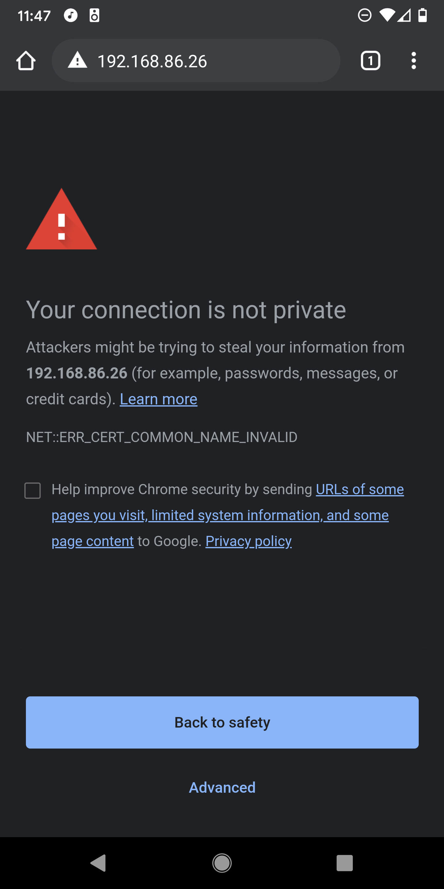
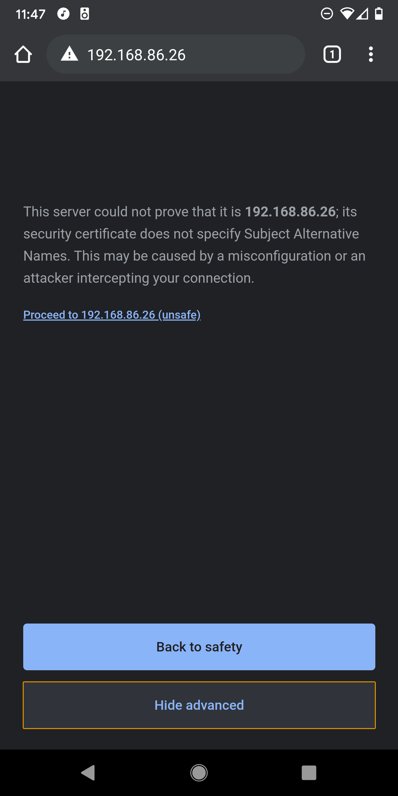
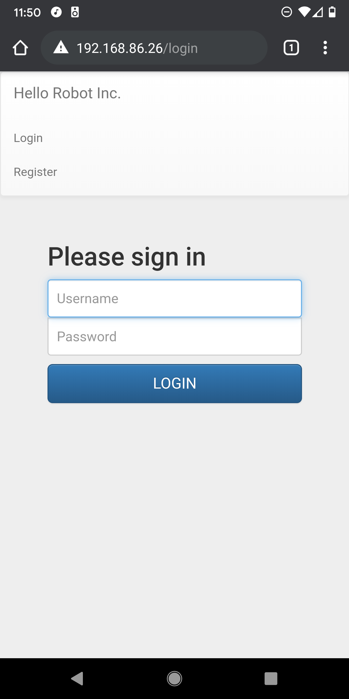
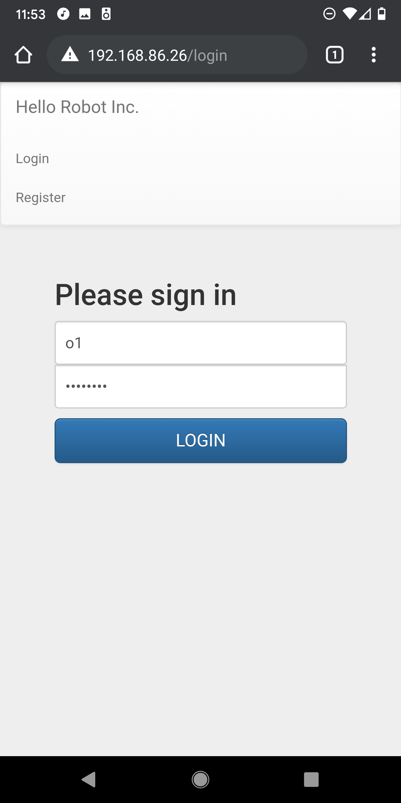
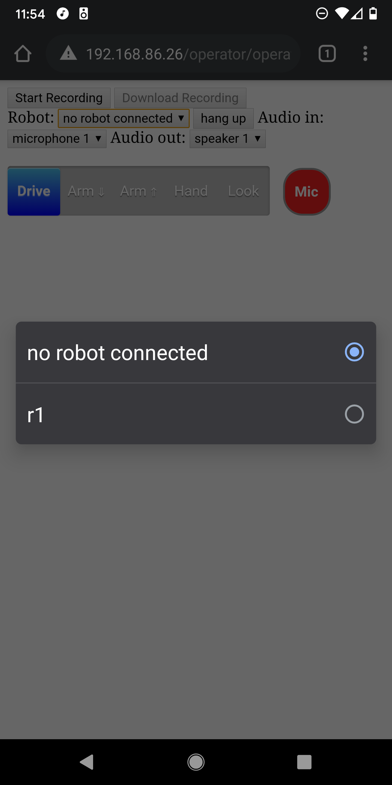
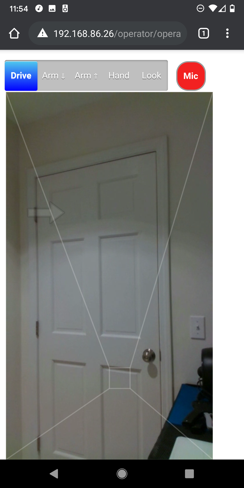
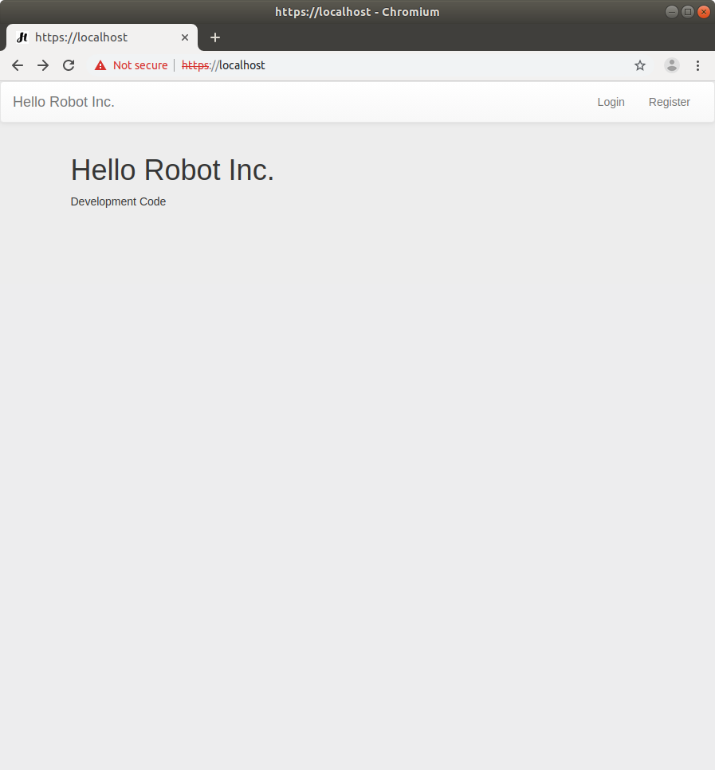
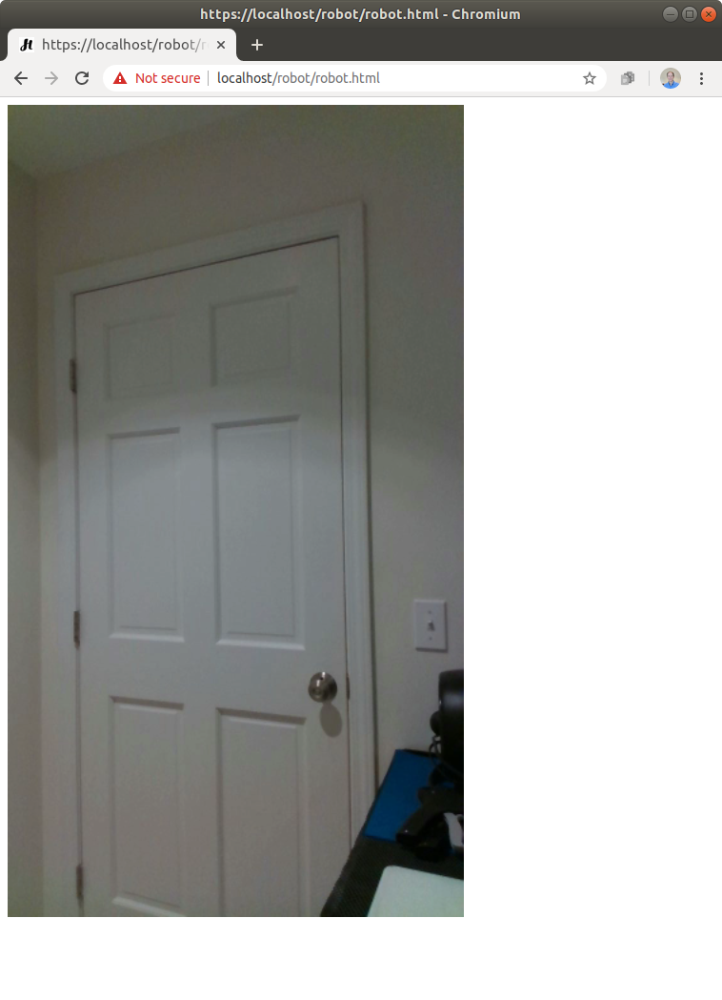
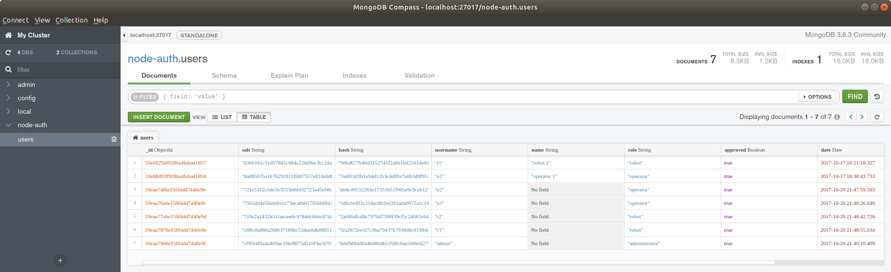

# Table of Contents

+ [Overview](#over)
  + [History](#hist)
  + [The Robot and the Operator both use Web Browsers](#browsers)
  + [The Web Server](#server)
+ [Getting Started](#getting_started)
  + [Installation](#install)
  + [Quick Start](#quick)
  + [Slower Start](#slower)
+ [Setting Up a Server](#server_setup)
  + [Credentials for Robots and Operators](#credentials)
  + [Running the Server on the Robot's Onboard Computer](#server_onboard)
  + [Running the Server on Amazon Lightsail](#server_lightsail)
+ [Licenses](#licensing)

<a name="over"/>

# Overview

This repository holds code that enables a person (the operator) to remotely teleoperate a Stretch RE1 (the robot) through a recent Chrome/Chromium web browser on an Android mobile phone, laptop, or desktop. The Stretch RE1 is a mobile manipulator from Hello Robot Inc.

**WARNING: This prototype code has been useful to the community, but is not well tested. There are also security issues, especially if you use the default credentials. Use this code at your own risk.** 

<a name="hist"/>

## History

When we started [Hello Robot Inc.](https://hello-robot.com) back in 2017, part of our goal was to create a robot that could be intuitively teleoperated from afar. We took an iterative approach, building a series of 7 prototype robots before the Stretch RE1 that we sell today. In conjunction with these prototypes, we developed a series of web interfaces, so that we could control our robots via a web browser and test remote teleoperation. While we eventually deemphasized this aspect of the robot, we thought it could be useful to the community. With this goal in mind, we ported parts of our old web interface code to the Stretch RE1 and made them available in this repository back in June of 2020.

Since then, we've been gratified to learn of others working with this code. For example, [The Human Centered Robotics Lab](https://hcrlab.cs.washington.edu/) at the University Washington has made impressive improvements to the code, which can be found in [their repository](https://github.com/hcrlab/stretch_web_interface). We've also learned that the [The Human Factors and Aging Laboratory](https://hfaging.ahs.illinois.edu/) at the University of Illinois at Urbana-Champaign has explored this interface as part of their impressive research to improve the lives of older adults.

<a name="browsers"/>

## The Robot and the Operator both use Web Browsers

This web interface works via [Web Real-Time Communication (WebRTC)](https://en.wikipedia.org/wiki/WebRTC). Code runs in a browser on the robot, in a browser on the operator's device (e.g., a mobile phone), and on a server. This is analogous to the robot and the operator video conferencing with one another, although they communicate via realtime data in addition to audio and video. By using web browsers, the robot and the operator make use of well-tested high-performance implementations of WebRTC. This symmetry also simplifies development, since a developer can use the same browser-based developer tools on both sides of the communication. The robot's browser and the operator's browser first login to the server, which helps connect them and provides them with the interface code.

The robot’s browser uses [rosbridge](http://wiki.ros.org/rosbridge_suite) to connect with ROS on the robot. Rosbridge translates [JSON](https://en.wikipedia.org/wiki/JSON) from the robot’s browser into ROS communications and vice versa. The JavaScript code used by the robot’s browser to connect with ROS can be found in [ros_connect.js](https://github.com/hello-robot/stretch_web_interface/blob/master/robot/ros_connect.js) under the [robot directory](https://github.com/hello-robot/stretch_web_interface/tree/master/robot), which holds files made available to the robot's browser. 

With [puppeteer](https://github.com/puppeteer/puppeteer) the robot can automatically launch and login to its browser. For example, [start_robot_browers.js](https://github.com/hello-robot/stretch_web_interface/blob/master/start_robot_browser.js) uses puppeteer to launch the robot's browser and login.

While the robot’s browser has access to most of the robot via ROS, the operator’s browser can only access the robot indirectly through the robot’s browser. The robotic commands available to the operator’s browser can be found in [commands.js](https://github.com/hello-robot/stretch_web_interface/blob/master/shared/commands.js) under the [shared directory](https://github.com/hello-robot/stretch_web_interface/tree/master/shared), which holds files available to both the operator's browser and the robot's browser. The operator's browser also has access to files in the [operator directory](https://github.com/hello-robot/stretch_web_interface/tree/master/operator).

<a name="server"/>

## The Web Server

In the example below, the server runs on the robot. In a production environment, you would use an external server, instead of the robot, to handle things like connecting robots and operators behind firewalls. [In a later section](#server_lightsail), we provide an example of an external server that uses [Amazon Lightsail](https://aws.amazon.com/lightsail/). When used on a production server with proper certificates, this code uses HTTPS and avoids scary messages. 

The web server uses the [Express](https://expressjs.com/) web framework with [Pug](https://pugjs.org/api/getting-started.html) templates. The server provides a WebRTC [signaling service](https://www.html5rocks.com/en/tutorials/webrtc/infrastructure/) using [socket.io](https://socket.io/). It uses [Redis](https://redis.io/) to store sessions. 

[passport](http://www.passportjs.org/) provides authentication for the robot and the operator. [mongoose](https://mongoosejs.com/) and a [MongoDB](https://www.mongodb.com/) database store credentials for robots and operators. The *stretch_web_interface* repository comes with default MongoDB content found at [./mongodb/](./mongodb/) for testing behind a firewall. These default contents come with multiple robot and operator accounts. **Make sure not to use these default database contents on a deployed system!** 

By default, [send_recv_av.js](./shared/send_recv_av.js) uses a free STUN server provided by Google. [The Amazon Lightsail example below](#server_lightsail) uses [coturn](https://github.com/coturn/coturn) as a [STUN and TURN server](https://www.html5rocks.com/en/tutorials/webrtc/infrastructure/).   

<a name="getting_started"/>

# Getting Started

<a name="install"/>
 
## Installation 

These installation instructions describe how to install both the server and relevant ROS code on the onboard computer of a Stretch RE1 robot. This is suitable for use on a trusted and secure local area network (LAN) behind a strong firewall. 

The web interface depends on [stretch_ros](http://github.com/hello-robot/stretch_ros), which is used to control the robot. You should first make sure it is up-to-date and working properly on the robot.

Clone the *stretch_web_interface* repository to ~/catkin_ws/src/ on the robot. 

```
cd ~/catkin_ws/src/
git clone https://github.com/hcrlab/stretch_web_interface.git
```

Run catkin_make.

```
cd ~/catkin_ws/
catkin_make
rospack profile
```

Run the installation script. 

```
cd ~/catkin_ws/src/stretch_web_interface/bash_scripts/
sudo ./web_interface_installation.sh
```

WARNING: The script uninstalls tornado using pip to avoid a rosbridge websocket immediate disconnection issue. This could break other software on your robot.

 <!---
To setup firebase:

Create a new file
```
shared/database.config.js
```
Copy the data from `StretchTeleop Firebase: Password` in the [lab wiki](https://github.com/hcrlab/private_wiki/wiki/Lab-account-login-information) into that file.
--->

<a name="quick"/>

## Quick Start

When running on a trusted and secure local area network (LAN) behind a strong firewall, you can use the following insecure method to more conveniently start the system.

#### Calibrate the Robot

First, make sure the robot is calibrated. For example you can run the following command.

```
stretch_robot_home.py
```

#### Start ROS

Next, in a terminal, run the following command to start ROS. This will start ROS nodes on the robot for the D435i camera, the driver for Stretch RE1, and rosbridge. Rosbridge connects JavaScript running in the robot's browser to ROS using JSON. 

```
roslaunch stretch_web_interface web_interface.launch
```

#### Start the Web Server and the Robot's Browser

In another terminal, run the following command to start the web server on the robot, launch the robot's browser, and log the robot into the browser. The convenience script calls start_robot_browser.js, which uses [puppeteer](https://github.com/puppeteer/puppeteer) to log the robot into its browser.

```
roscd stretch_web_interface/bash_scripts/
./start_web_server_and_robot_browser.sh 
```

Typically, this script can be exited with Ctrl+C and then restarted without issue.

**WARNING: start_robot_browser.js contains the default robot credentials in plain text! This is only appropriate for simple testing on a local network behind a firewall. The username and password are public on the Internet, so this is not secure! Deployment would require new credentials and security measures.**

#### Start the Operator's Browser

You will now login to a browser as the operator and connect to the robot. You can use a Chrome browser on a recent Android mobile phone or a recent Chrome/Chromium browser on a laptop or desktop. 

Open the browser goto the robot’s IP address. You can use `ifconfig` on the robot to determine its IP address.

Select "Advanced" and then click on "Proceed to localhost (unsafe)".






Click on "Login" and use the following username and password.

```
username:
o1

password
xXTgfdH8
```

**WARNING: This is a default operator account provided for simple testing. Since this username and password are public on the Internet, this is not secure. You should only use this behind a firewall during development and testing. Deployment would require new credentials and security measures.**





You should now see a screen like the following. Click on "no robot connected" and select the robot "r1" to connect to it. 




You should now see video from the robot on your mobile phone or other device. Click in the designated regions to command the robot to move. You can also click on "Drive", "Arm" down, "Arm" up, "Hand" and "Look" to move different joints on the robot. 



<a name="slower"/>

## Slower Start

The following steps describe how to manually start the web server and the robot's browser on the robot, instead of using the convenience script described above. 

#### Calibrate the Robot

First, make sure the robot is calibrated. For example you can run the following command.

```
stretch_robot_home.py
```

#### Start ROS

Next, in a terminal, run the following command to start the ROS side of things. This will start ROS nodes on the robot for the D435i camera, the driver for Stretch RE1, and rosbridge. Rosbridge connects JavaScript running in the robot's browser to ROS using JSON. 

```
roslaunch stretch_web_interface web_interface.launch
```

#### Start the Web Server

In another terminal, run the following command to start the web server on the robot. 

```
roscd stretch_web_interface/bash_scripts/
./start_desktop_dev_env.sh 
```

#### Start the Robot's Browser

Open a Chromium browser on the robot and go to localhost. Select "Advanced" and then click on "Proceed to localhost (unsafe)".


Click on "Login" and use the following username and password.

```
username:
r1

password
NQUeUb98
```

**WARNING: This is a default robot account provided for simple testing. Since this username and password are public on the Internet, this is not secure. You should only use this behind a firewall during development and testing. Deployment would require new credentials and security measures.**




You should now see video from the robot's camera in the browser window. 



#### Start the Operator's Browser

Please see the instructions above.


<a name="server_setup"/>

# Setting Up a Server

The server for the web interface typically runs on the robot's onboard computer or on a remote machine connected to the Internet. 


<a name="credentials"/>

## Credentials for Robots and Operators

Credentials for robots and operators are stored on the server using [MongoDB](https://en.wikipedia.org/wiki/MongoDB). 

### Viewing and Editing Credentials

On the server, you can view and edit the credentials using `mongodb-compass`, which is installed by default. First, use the following command in a terminal to start the application.


```
mongodb-compass
```

Next, use "Connect to Host" by typing `localhost` in the Hostname area at the top of the window and then clicking the green "CONNECT" button at the bottom right of the window. This should show you various databases. The `node-auth` database holds the web interface credentials. 

Clicking on `node-auth` will show a collection named `users`.

Clicking on `users` will show the current credentials.

If you've only used the default development credentials in this repository, you should see entries for the following: three robots with the usernames r1, r2, and r3; three operators with the usernames o1, o2, and o3; and an administrator with the username admin. Each entry consists of encrypted password information (i.e., salt and hash), a username, a name, a role, a date, and a Boolean indicating whether or not the user has been approved. Without approval, the user should be denied access. The role indicates whether the entry is for a robot or an operator. You can click on the image below to see what this should look like.



### Creating New Credentials

First, start the server. Next, go to the web page and click `register`. Now enter a username and a password. This process creates a new user entry in MongoDB. 

You can now follow the instructions for viewing credentials above to view the new account you just created. In order for this account to function, you will need to edit the role to be `operator` or `robot` and edit approved to be `true`. You can do this by clicking on the elements with `mongodb-compass`.

Prior to testing anything on the Internet, you should delete all of the default credentials. The default credentials are solely for development on a secure local network behind a firewall.

### Backing Up and Restoring Credentials

On the server, you can backup credentials using a command like the following in a terminal. You should change `./` to match the directory into which you want to saved the backup directory. 

```mongodump --db node-auth --out ./```

You can restore backed up credentials using the following command in a terminal. You'll need to change `./` to match the directory that holds the backup directory.

```mongorestore -d node-auth ./node-auth/user.bson```


<a name="server_onboard"/>

## Running the Server on the Robot's Onboard Computer

Running the server on the robot is useful when the robot and the operator are both on the same local area network (LAN). For example, a person with disabilities might operate the robot in their home, or you might be developing new teleoperation code. In these situations, the robot, the operator's browser, and the server should all be behind a strong firewall, reducing security concerns. 

<a name="server_lightsail"/>

## Running the Server on Amazon Lightsail

Running the server on a remote machine can be useful when the robot and the operator are on separate LANs connected by the Internet. This can enable a person to operate the robot from across the world. In this section, we'll provide an example of setting up the server to run on an Amazon Lightsail instance. **This is not a hardened server and is only intended to serve as a helpful example. It likely has significant security shortcomings and is very much a prototype. Use at your own risk.** 

One of the challenges for remote teleoperation is that browsers on different LANs can have difficulty connecting with one another. Peer-to-peer communication may not be achievable due to firewalls and other methods used to help secure networks. For example, home networks, university networks, and corporate networks can all have complex configurations that interfere with peer-to-peer communication. Running the server on a remote machine connected to the Internet helps the robot's browser and the operator's browser connect to one another using standard methods developed for [WebRTC](https://en.wikipedia.org/wiki/WebRTC) video conferencing over the Internet. The server performs a variety of roles, including the following: restricting access to authorized robots and operators; helping operators select from available robots; [WebRTC signaling](https://www.html5rocks.com/en/tutorials/webrtc/infrastructure/), [Session Traversal Utilities for Network Address Translation (STUN)](https://en.wikipedia.org/wiki/STUN), and [Traversal Using Relays around Network Address Translation (TURN)](https://en.wikipedia.org/wiki/Traversal_Using_Relays_around_NAT). Notably, when direct peer-to-peer connectivity fails, TURN relays video, audio, and data between the robot's browser and the operator's browser. **Relaying data is robust to networking challenges, but can incur charges due to data usage.**

### Amazon Lightsail Setup in Brief

This section describes the steps we used to create an Amazon Lightsail instance that runs the server for the web interface.

+ Obtain a domain name to use for your server.
+ Create a new [Amazon Lightsail](https://aws.amazon.com/lightsail/) instance.
  + We used an OS only instance with Ubuntu 20.04, 512 MB RAM, 1 vCPU, 20 GB SSD.
+ [Create a static IP address](https://lightsail.aws.amazon.com/ls/docs/en_us/articles/lightsail-create-static-ip) and attach it to your instance.
+ [Connect your new instance to SSH](https://lightsail.aws.amazon.com/ls/docs/en_us/articles/amazon-lightsail-ssh-using-terminal), so that you can access it. 
  + A command like the following can then be used to login to your instance: `ssh -i /path/to/private-key.pem username@public-ip-address`.
+ While logged into your instance. 
  + Run `sudo apt-get update` to avoid installation issues.
  + Install helpful packages.
    + `sudo apt install emacs`
    + `sudo apt install net-tools`
  + Configure Git.
    + `git config --global user.name "FIRST_NAME LAST_NAME"`
    + `git config --global user.email "MY_NAME@example.com"`
  + Clone this GitHub repository.
    + `cd`
    + `mkdir repos`
    + `git clone https://github.com/hello-robot/stretch_web_interface.git`
  + Use [certbot](https://certbot.eff.org/) from [Let's Encrypt](https://letsencrypt.org/) to obtain certificates so that your server can use [Hypertext Transfer Protocol Secure (HTTPS)](https://en.wikipedia.org/wiki/HTTPS). HTTPS is required to fully utilize WebRTC. 
    + You will need to first connect your domain name to the static IP address used by your instance. 
    + Follow [certbot installation instructions for Ubuntu 20.04](https://certbot.eff.org/lets-encrypt/ubuntufocal-other).
  + Run the teleoperation server installation script
    + `cd ~/repos/stretch_web_interface/bash_scripts/`
    + `./web_server_installation.sh`
+ Initialize the database with secure credentials for at least one robot and one operator. For example, you can do the following. 
  + Create and export credentials from MongoDB by running a server on your robot. 
  + Use `scp` to copy the exported credentials database from your robot's computer to your Lightsail instance by running a command like `scp -ri ./LightsailDefaultKey-us-east-2.pem ./mongodb_credentials ubuntu@public-ip-address:./` on your robot's computer.
  + On your Lightsail instance, restore the credentials database with a command like `mongorestore -d node-auth ./mongodb_credentials/node-auth/users.bson`
+ While logged into your instance.
  + Edit the [coturn](https://github.com/coturn/coturn) configuration file.
    + Find your instance's private IP address by running `ifconfig -a` and looking at the `inet` IP address. 
    + Confirm your instance's public IP address and your domain name by running `ping YOUR-DOMAIN-NAME` and looking at the IP address. 
    + Add the following lines at appropriate locations in `/etc/turnserver.conf`.
      + `listening-ip=PRIVATE-IP-ADDRESS`
      + `relay-ip=PRIVATE-IP-ADDRESS`
      + `external-ip=PUBLIC-IP-ADDRESS`
      + `Verbose`
      + `lt-cred-mech`
      + `pkey=/etc/letsencrypt/live/YOUR-DOMAIN-NAME/privkey.pem`
      + `cert=/etc/letsencrypt/live/YOUR-DOMAIN-NAME/cert.pem`
      + `no-multicast-peers`
      + `secure-stun`
      + `mobility`
      + `realm=YOUR-DOMAIN-NAME`
  + Create TURN server accounts and credentials.
    + Create an administrator account.
      + `sudo turnadmin -A -u ADMIN-NAME -p ADMIN-PASSWORD`
    + Create a TURN user. In the next step, you will add these credentials to `./stretch_web_interface/shared/send_recv_av.js`.
      + `sudo turnadmin -a -u TURN-USER-NAME -r YOUR-DOMAIN-NAME -p TURN-USER-PASSWORD`
    + Open `./stretch_web_interface/shared/send_recv_av.js` in an editor.
      + Comment out the free STUN server.
      + Uncomment the STUN and TURN servers and fill in the values using your domain name and the credentials you just created (i.e., YOUR-DOMAIN-NAME, TURN-USER-NAME, and TURN-USER-PASSWORD). 
          + The relevant code will look similar to `var pcConfig = { iceServers: [ {urls: "stun:YOUR-DOMAIN-NAME", username "TURN-USER-NAME", credentials: "TURN-USER-PASSWORD}, {urls: "turn:YOUR-DOMAIN-NAME", username "TURN-USER-NAME", credentials: "TURN-USER-PASSWORD}]};`
+ [Open the following ports for your Amazon Lightsail instance.](https://lightsail.aws.amazon.com/ls/docs/en_us/articles/amazon-lightsail-editing-firewall-rules) These are standard ports for HTTPS, STUN, and TURN. 
  + `HTTPS TCP 443`
  + `Custom TCP 3478`
  + `Custom TCP 5349`
  + `Custom UDP 3478`
  + `Custom UDP 5349`
+ Reboot your instance.
+ Login to your instance and run the following commands to start the server.
  + `cd ~/repos/stretch_web_interface/bash_scripts/`
  + `./start_server_production_env.sh`
+ Your server should now be running and you can test it by taking the following steps.
  + Turn on and calibrate your robot.
  + Use your robot's Chromium browser to visit your server's domain and login with the robot's credentials that you created. 
  + Open a Chrome or Chromium browser of your own on another computer or recent Android phone. Visit your server's domain and login with the operator credentials you created. If you want to test communication between distinct networks, you could turn off your phone's Wi-Fi and then either use your phone or tether to your phone to connect from the mobile phone network to your robot. Please note that this has only been tested with the Chrome browser on recent Android phones. 
  + Once you've logged in as an operator, you should be able to select your robot from the drop down list and begin controlling it. 
+ **After trying it out, be sure to shutdown your Amazon Lightsail instance. It is not hardened and likely has security vulnerabilities. It would be risky to leave it on over a significant length of time.**

<a name="licensing"/>

# Licenses

This software is intended for use with S T R E T C H (TM) RESEARCH EDITION, which is a robot produced and sold by Hello Robot Inc. For further information, including inquiries about dual licensing, please contact Hello Robot Inc.

For license details for this repository, see the LICENSE files, including TUTORIAL_LICENSE.md, WEBRTC_PROJECT_LICENSE.md, and LICENSE.md. Some other sources and licenses are described by comments found within the code.

The [Apache 2.0](http://www.apache.org/licenses/LICENSE-2.0) license applies to all code written by Hello Robot Inc. contained within this repository. We have attempted to note where code was derived from other sources and the governing licenses. 
